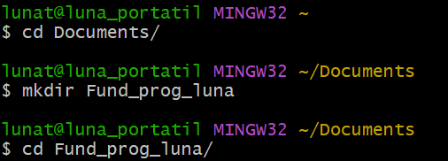
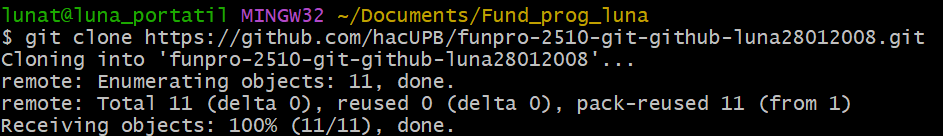
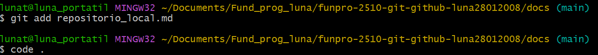
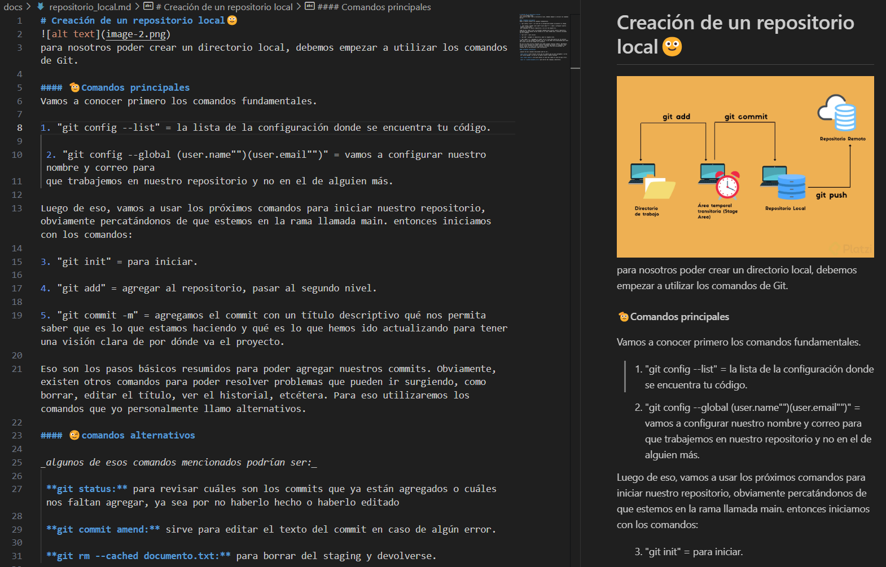
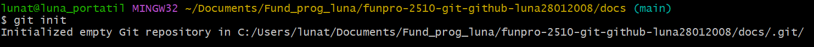
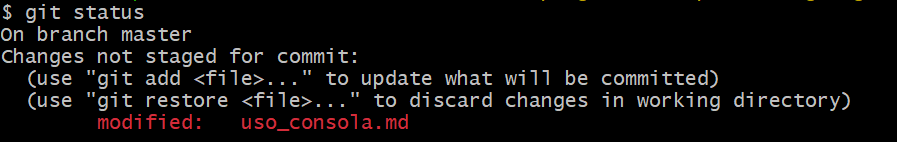
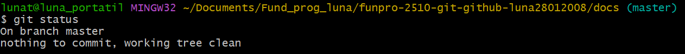

# Bitácora: Mi proyecto de Git y GitHub
Nombre del estudiante:  luna michelle torres nuñez 
Id.: 00568004

Este proyecto posibilita consolidar las habilidades obtenidas en el manejo de **Git** y **GitHub**. Durante el proceso se adquiere el conocimiento de administrar repositorios locales y remotos a emplear la consola para crear y modificar archivos y a efectuar commits de forma eficaz. La meta fundamental es estructurar un proyecto desde el inicio registrar cada etapa ejecutada y imitar un trabajo colaborativo empleando GitHub para sincronizar el repositorio local con el repositorio remoto. Este proyecto implementa instrumentos fundamentales para la gestión de versiones y la cooperación eficaz en proyectos de programación. 

## Objetivos 
- Navegar correctamente entre directorios y archivos, usando la consola para crear y editar estos entre otras opciones.
- Conocer y crear repositorios locales según usando los comandos de **Git**
- Crear y manejar el directorio remoto en **GitHub** y la sincronización con el repositorio local.
- Documentar de manera detallada sobre los procesos realizados, incluyendo screenshots de los diferentes pasos y comandos realizados.

## Tabla de Contenido

| Nombre |descripción| enlace |
|--------|-----------|--------|
|clon repositorio remoto|descripción del proceso de clonado|
|src/    |introducción de codigo funcional para comprobacion de conocimientos| [src](./src/)|
|docs/|tres directorios disponibles de información descriptiva|[docs](./docs/) |
| _uso_consola.md|descripción de conceptos basicos del uso de la consola|[uso consola](./docs/uso_consola.md)
| _repositorio_remoto.md |vinculación de repositorios y funcionamiento de los mismos|[repositorio remoto](./docs/repositorio_remoto.md)|
| _repositorio_local.md|creación e iniciación de repositorios(conceptos basicos|[repositorio local](./docs/repositorio_local.md)|
|imagenes|banco de imagenes de todas las ilustraciones usadas en el proyecto|[imagenes del proyecto](./imagenes/) | 

### Clon del repositorio remoto
1. Para poder abrir nuestro repositorio remoto, debemos asegurarnos de estar en el sitio en el cual vamos a trabajar, y a su vez que este no sea un repositorio sino un directorio.

>comando _mkdir:_para crear el directorio y comando _cd:_ para acceder a el.

2. Luego de asegurarnos de estar en la ubicacion correcta tomaremos el link y lo clonaremos con nuestro comando correspondiente.

>comando _git clone (URL):_ para poder acceder a nuestro directorio remoto y empezar a trabajar en el.

### Creación y edición de la estructura del proyecto

1. Crearemos los diferentes directorios que utilizaremos para nuestro proyecto, luego de eso empezaremos a documentar en ellos con los diferentes codigos que requerimos.

> En la captura de pantalla se muestra la creacion de los tres directorios en conjunto, y un breve ejemplo de la creación de el archivo uso_consola.md dentro del directorio docs/.
2. Colocaremos la diferente información requerida dentro de cada documento, usaremos nuestro de texto de preferencia sea este **Vim** o **Visual Estudio Code**

> Ejemplificación de la edicion de texto en code

### Agregar lo elaborado al staging y elaborar los commits

1. Debemos tener en cuenta que para empezar a agregar al repositorio y realizar los commits, primero debemos ejecutar el git init.
 
 >No olvidar el git init para poder empezar a guardar en nuestro repositorio y tener historial de codigo

 2. Teniendo en cuenta que hicimos este paso debemos agregar el archivo al git y colocar el commit, que recordemos que no puede ser cualquier texto, debe ser un texto que describa el paso que realizamos en este y nos sirva para ubicarnos en el proyecto.
 
 
 >_Nota:_ debemos tener en cuenta que cada vez que editemos ese archivo que ya anteriormente le hemos hecho **git add** y **Git Commit** debemos repetir estos pasos para que los ajustes se guarden.
 A continuación veremos una buena practica que nos permitira saber si todo se ha guardado y esta en orden.

 3. Rectificaremos que todos los ajustes y actualizaciones de nuestros documentos esten registrados usando nuestro comando de **git status**.
 
 > si colocamos nuestro comando y sale este mensaje con algo en rojo, quiere decir que hicimos alguna actualizacion en nuestro archivo la cual no hemos registrado.

 
 > por el contrario si nos sale el mensaje de "nothing to commit", quiere decir que todos nuestros cambios estan correctos y añadidos y podemos continuar con seguridad.

 ### Agregamos todo a nuestro repositorio remoto

 - usando el comando simple de "git push" terminamos agregando nuestros cambios a nuestro repositorio remoto luego de haber echo todos nuestros ajustes y commits y asi terminamos.

 ## Buenas prácticas al momento de programar 

1. **realizar commits frescuentes y descriptivos:** esto ayudará a un código más claro y mas trabajable.
2. **usar branches para nuevas funcionalidades:** permite un código limpio y evita conflicto con nuevas funcionalidades.
3. **mantener el repositorio limpio y ordenado::** evitando subir archivos demasiado extenso o innecesarios, usando el archivo **.gitignore**, podemos ayudarnos a mitigar estas cosas.
3. **usar las etiquetas correctas**
4. **revisar y probar los commits**

## Conclusión

Este proyecto me ha brindado la oportunidad de ampliar mis conocimientos sobre Git y GitHub instrumentos fundamentales para cualquier programador. Durante el proceso logré implementar conceptos fundamentales como la administración de repositorios locales y remotos la sincronización de modificaciones mediante la consola y la relevancia de registrar de manera adecuada cada etapa. Además mi experiencia con commits y ramas me hizo comprender la importancia de conservar un historial ordenado y limpio para simplificar la cooperación en equipo. Con este proyecto no solo fortalecí mis habilidades técnicas en el manejo de versiones sino que también asimilé las mejores prácticas a implementar para garantizar un flujo de trabajo eficaz y profesional. Indudablemente estas capacidades serán esenciales en mi educación y en proyectos de programación futuros. 